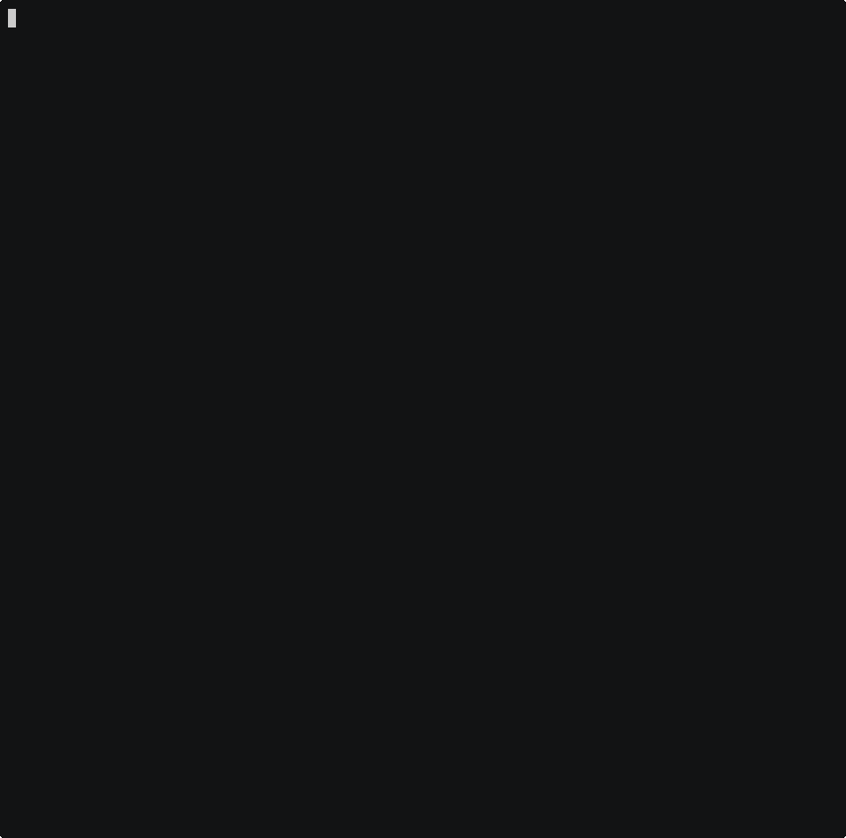

# Islo sandbox backend demo

`SandboxToolset` driving a real [islo.dev](https://islo.dev) microVM, for
[apache/airflow#71672](https://github.com/apache/airflow/pull/71672).



A deterministic pydantic-ai `FunctionModel` calls each of the four sandbox
tools in turn, so the run is reproducible and needs no LLM.

```console
pip install "apache-airflow-providers-common-ai[sandbox-islo]"
export ISLO_API_KEY=...
python demo_sandbox_islo.py
```

This branch carries only the demo; it is not part of the pull request.
